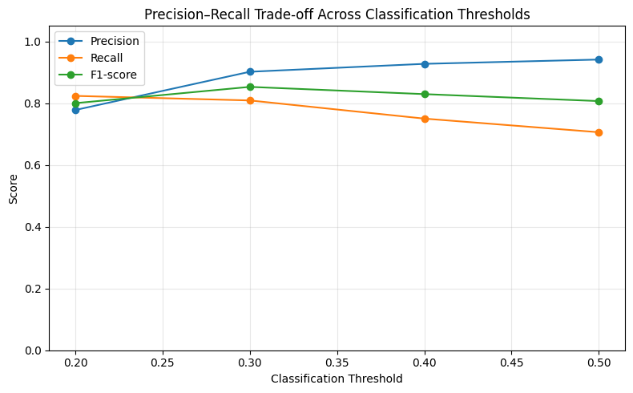
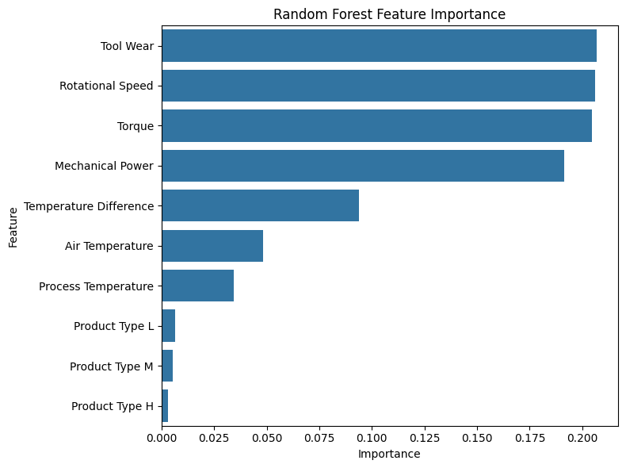

# Construction Equipment Predictive Maintenance

**Predicting machine failure from operational sensor data and translating model output into maintenance-oriented decisions.**

This project uses the **AI4I 2020 Predictive Maintenance Dataset** as a proxy industrial telemetry dataset to demonstrate a predictive-maintenance workflow relevant to equipment-intensive environments such as construction.

## Business Problem

Unexpected equipment failure can create downtime, repair costs, idle labor, schedule disruption, and operational risk. The project asks whether pre-failure operating measurements can be used to identify high-risk observations early enough to support inspection, closer monitoring, or planned maintenance.

## Dataset

The project uses the **AI4I 2020 Predictive Maintenance Dataset** from the UCI Machine Learning Repository. It contains 10,000 synthetic observations designed to reflect industrial predictive-maintenance data, with product-quality information, temperatures, rotational speed, torque, tool wear, an aggregate machine-failure target, and five failure-mode indicators.

- Source: [UCI Machine Learning Repository — AI4I 2020](https://archive.ics.uci.edu/dataset/601/ai4i)
- DOI: [`10.24432/C5HS5C`](https://doi.org/10.24432/C5HS5C)
- Dataset license: CC BY 4.0

The five failure-mode indicators are retained for EDA but excluded from the binary model features to avoid target leakage.

## Workflow

### 1. Data loading and inspection

The first notebook checks shape, data types, missing values, duplicates, feature cardinality, descriptive statistics, and target imbalance. It also exports a Parquet copy of the dataset.

### 2. Exploratory analysis and feature engineering

The EDA examines failure prevalence by product type and compares operating conditions between failed and non-failed observations. It also investigates nonlinear torque/RPM behavior and creates two engineered features:

- **Temperature difference:** process temperature minus air temperature
- **Mechanical power:** torque multiplied by angular velocity

### 3. Predictive modeling

A class-weighted `RandomForestClassifier` is used as the main model. The analysis includes:

- stratified train/test splitting
- a naive all-zero baseline
- precision, recall, F1, ROC-AUC, and Average Precision
- confusion matrices
- classification-threshold sensitivity
- impurity-based feature importance
- business interpretation of false positives and false negatives

## Key Results

| Metric / operating point | Result |
|---|---:|
| ROC-AUC | **0.966** |
| Average Precision | **0.853** |
| Selected exploratory threshold | **0.30** |
| Precision at 0.30 | **0.902** |
| Recall at 0.30 | **0.809** |
| F1-score at 0.30 | **0.853** |
| Failures detected | **55 / 68** |
| False failure alerts | **6** |

Lowering the operating threshold from 0.50 to 0.30 increased failure detection while keeping false alerts relatively limited. In a real maintenance setting, the final threshold should be selected from the actual costs of missed failures and unnecessary inspections rather than from model metrics alone.



## Main Findings

- Tool wear, rotational speed, torque, and engineered mechanical power are the strongest Random Forest importance signals in the binary model.
- Temperature difference adds a complementary thermal signal and is more informative than either raw temperature variable alone.
- Product type contributes comparatively little additional information for the aggregate binary target once operating conditions are included.
- The relationship between failure and torque/RPM is nonlinear, supporting the use of a tree-based model.
- Model predictions are best interpreted as early-warning **signals** that can trigger inspection or monitoring, not as automatic repair decisions.



Feature importance is descriptive rather than causal. Mechanical power is calculated from torque and rotational speed, so importance can be shared across correlated predictors.

## Repository Structure

```text
.
├── data/
│   ├── raw/
│   │   └── .gitkeep
│   └── processed/
│       └── .gitkeep
├── notebooks/
│   ├── 01_data_loading.ipynb
│   ├── 02_eda.ipynb
│   └── 03_modeling.ipynb
├── outputs/
│   ├── figures/
│   └── tables/
├── scripts/
│   └── download_data.py
├── .gitignore
├── LICENSE
├── README.md
└── requirements.txt
```

## Reproducing the Analysis

Each notebook can run independently in a fresh Google Colab runtime. If the dataset is not already available locally, it is loaded automatically from UCI.

For local use:

```bash

python -m venv .venv

# Windows
.venv\Scripts\activate

# macOS / Linux
source .venv/bin/activate

pip install -r requirements.txt
python scripts/download_data.py
```

Then run the notebooks in numerical order.

The download script validates the expected 10,000 × 14 dataset shape and creates both the raw CSV and processed Parquet files.

## Limitations and Next Steps

AI4I is synthetic industrial data rather than real construction-equipment telemetry. Real deployment would require machine-specific telemetry, equipment age and model, operating hours, maintenance history, load and environmental conditions, independent validation, and cost-based threshold selection.

A useful extension would be multi-label failure-mode prediction using TWF, HDF, PWF, OSF, and RNF as separate targets. Mode-specific models could reveal relationships that are diluted in the aggregate binary target, although the small number of observations for some failure modes would limit reliable evaluation.

## Technology used

Python · pandas · NumPy · Matplotlib · seaborn · scikit-learn · Parquet/pyarrow · Google Colab

## License

Project code is available under the MIT License. The AI4I dataset remains subject to its original CC BY 4.0 license.


